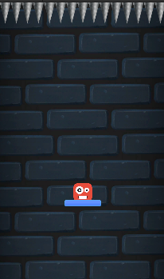
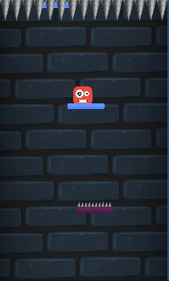
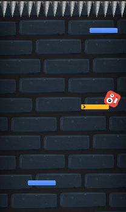

# Game-3-Cube-Fall
Game Cube Fall ini saya buat dengan mengikuti beberapa latihan cara membuat game di youtube dan beberapa course yang saya temukan. Setelah mengumpulkan beberapa vidio untuk latihan pemrograman bahasa C# saya mencoba untuk mengimplemntasikan dan menjadikan sebuah game. Dari situ lah game Cube Fall ini saya coba buat dengan mengikuti tutorial

Cube Fall adalah game yang hampir sama dengan game yang saya buat sebelumnya(banana jump) akan tetapi cube fall ini berbeda dengan game banana jump. Jika banana jump lompat keatas maka cube fall akan bergerak kebawah atau jatuh kebawah. Di dalam game ini karakternya berbentuk cube sesuai dengan nama gamenya, dan terdapat sebuah kotak di bawahnya untuk di jadikan pijakan agar tidak jatuh. Jadi pemain harus menjatuhkan cubenya kebawah agar tidak terkena duri yang ada diatasnya, duri akan bergerak menuju kebawah. Jika pemain jatuh atau terkena duri maka pemain akan mengulang permainan.

Untuk cara menggerakkan karakternya, pemain hanya perlu menekan tombol pada keyboard arah kanan dan arah ke kiri saja

Untuk game Cube Fall gambarannya seperti di bawah :

  
